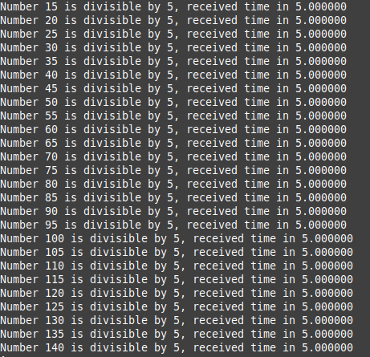
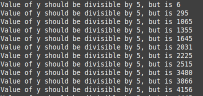
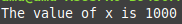
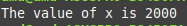

# Threading Examples in C (C11 `<threads.h>` and `<stdatomic.h>`)

This repository contains three small programs demonstrating core multithreading concepts in C:

---

## 1. Condition Variable Example

Demonstrates how a thread can wait on a condition and be signaled by another thread.



---

## 2. Race Condition Example

Shows what happens when two threads update shared state without synchronization.  
The output varies depending on timing, compiler optimizations, and CPU scheduling.



---

## 3. Atomic vs. Non-Atomic Increment Example

This example illustrates why `<stdatomic.h>` exists.  
The program can be built in two ways:

### • Without `USE_ATOMICS`
Two threads increment the same integer without synchronization.  
This leads to lost updates and an incorrect final value (typically `1000`).



### • With `USE_ATOMICS`
`atomic_fetch_add()` performs an atomic read-modify-write.  
The increment operations no longer interfere, and the program consistently prints `2000`.



---

# Build Instructions

Build all programs:

```bash
cmake -S . -G "Unix Makefiles" -B build 
cmake --build build

./build/cnd_mutex_example
./build/race_condition_example
./build/non_atomic_example

```

For the atomic version:
```bash
cmake -S . -G "Unix Makefiles" -B build -DCMAKE_C_FLAGS="-DUSE_ATOMICS"
cmake --build build
./build/non_atomic_example
```